# Architecture

OmniCoreAgent is built with a modular, extensible architecture designed for production-grade reliability and scalability. It follows a "layered" approach where each component can be swapped or extended without impacting the others.

---

## High-Level Overview

OmniCoreAgent acts as the central orchestrator between users, Large Language Models (LLMs), and external tools (via MCP or local functions).

```mermaid
graph TB
    User[👤 User Application] --> Agent[🤖 OmniCoreAgent]
    
    subgraph "Core Components"
        Agent --> Reasoning[🔄 ReAct Engine]
        Agent --> Router[🛤️ Router / Workflow]
        Agent --> MemoryM[💾 Memory Manager]
        Agent --> EventM[📡 Event Manager]
    end
    
    subgraph "Capabilities"
        Reasoning --> LLM[🧠 LiteLLM Integration]
        Reasoning --> Tools[🛠️ Tool Orchestrator]
        
        Tools --> MCP[🔌 MCP Client]
        Tools --> Local[🔧 Local Tools Registry]
        Tools --> Skills[🎓 Agent Skills]
    end
    
    subgraph "Storage & Streaming"
        MemoryM --> MStores[📦 Memory Backends <br/> Redis, DB, Mongo]
        EventM --> EStores[📈 Event Backends <br/> Redis Stream, memory]
    end
    
    LLM --> Providers[☁️ AI Cloud / Local Models]
```

---

## Core Layers

### 1. The Reasoning Layer (ReAct)
The heart of OmniCoreAgent is its implementation of the **ReAct (Reason + Act)** pattern. Instead of a single completion, the agent engages in a loop:
- **Think**: Analyze context and user intent.
- **Act**: Call tools or sub-agents to gather info or perform actions.
- **Observe**: Read tool outputs and update internal state.
- **Answer**: Provide the terminal response once the goal is achieved.

### 2. The Storage Layer (Memory & Events)
OmniCoreAgent decouples data persistence from reasoning logic.
- **Memory Router**: Manages conversation history. It supports multiple backends (Redis, PostgreSQL, etc.) and can switch between them at runtime.
- **Event Router**: Handles real-time telemetry. Every thought and action is emitted as a structured event.

### 3. The Connectivity Layer (MCP & Local)
The framework provides a unified interface for all external actions:
- **MCP Transport**: Bridges the gap to the Model Context Protocol ecosystem via stdio, SSE, or Streamable HTTP.
- **Tool Registry**: A decorator-driven system for registering Python functions.
- **BM25 Retrieval**: A lexical search layer that filters thousands of tools down to a manageable context for the LLM.

---

## Data Flow: Processing a Request

1. **Initialization**: The agent loads its system instructions and tool indexes.
2. **User Input**: A `run(query, session_id)` call triggers the workflow.
3. **Context Retrieval**: The Memory Router fetches previous messages for the session.
4. **Tool Discovery**: If advanced tool use is enabled, BM25 finds the top relevant tools for the current query.
5. **LLM Interaction**: The reasoning loop begins. LiteLLM routes prompts to the configured provider.
6. **Execution**: If the LLM requests a tool, the Tool Orchestrator executes it (local or remote).
7. **Event Emission**: Throughout the process, the Event Router streams progress updates.
8. **Finalization**: The agent returns the response and session ID to the application.

---

## Enterprise Features

| Feature | Architectural Implementation |
|---------|-----------------------------|
| **Multi-Tenancy** | Session IDs isolate conversation states across different users. |
| **Observability** | Native Opik tracing and Redis Stream event logging. |
| **Fault Tolerance**| Built-in retries for tool calls and automatic connection recovery for MCP. |
| **Scalability** | Distributed memory backends allow agents to scale horizontally across servers. |

---

> [!TIP]
> This modular design allows you to use OmniCoreAgent as a lightweight local library or as the backbone of a high-scale, distributed AI platform.
